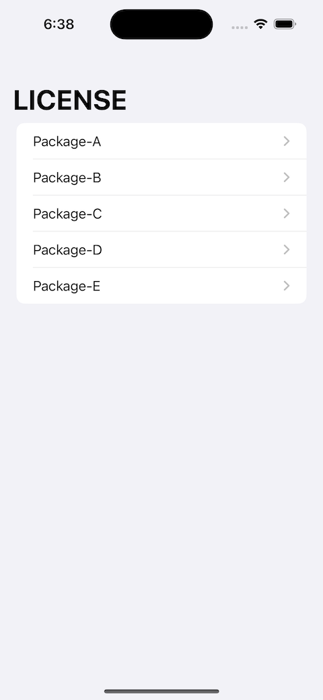

# LicenseList

Generate a list of licenses for the Swift Package libraries that your app depends on.

[](https://github.com/cybozu/LicenseList/issues)
[](https://github.com/cybozu/LicenseList/network/members)
[](https://github.com/cybozu/LicenseList/stargazers)
[](https://github.com/cybozu/LicenseList/)
[]()
[](https://github.com/cybozu/LicenseList/)

**Example**

|  |  |  |
| :--------------------------------: | :--------------------------------: | :--------------------------------------: |

## Requirements

- Written in Swift 5
- Compatible with iOS 13.0+
- Developement with Xcode 13.0+

## Installation

LicenseList is available through [Swift Package Manager](https://github.com/apple/swift-package-manager/).

**Xcode**

1. Select `File > Add Packages...`
2. Search `https://github.com/cybozu/LicenseList.git`
3. Add Package (add LicenseList library to target but don't add spp executable to target).

## Usage

1. Create `license-list.plist` at the project root directory and add it to the project as a bundle resource.

   ```bash
   $ cd [project root path]
   $ echo '<?xml version="1.0" encoding="UTF-8"?><!DOCTYPE plist PUBLIC "-//Apple//DTD PLIST 1.0//EN" "http://www.apple.com/DTDs/PropertyList-1.0.dtd"><plist version="1.0"><dict></dict></plist>' > license-list.plist
   ```

   ⚠️ Note: When you add `license-list.plist` to the project, you must remove the check mark from "Copy items if needed".

2. Add Run Script to the Build Phase of the Target.

   ```bash
   SOURCE_PACKAGES_PATH=`echo ${BUILD_DIR%Build/*}SourcePackages`

   # Build SourcePackagesParser
   xcrun --sdk macosx swift build -c release \
     --package-path ${SOURCE_PACKAGES_PATH}/checkouts/LicenseList \
     --product spp

   # Run SourcePackagesParser
   ${SOURCE_PACKAGES_PATH}/checkouts/LicenseList/.build/release/spp ${SRCROOT} ${SOURCE_PACKAGES_PATH}
   ```

   ⚠️ Note: This "Run Script" should be added before the "Copy Bundle Resources" step.

3. Coding (Example)

   - with UIKit

     ```swift
     import LicenseList

     // in ViewController
     let fileURL = Bundle.main.url(forResource: "license-list", withExtension: "plist")!
     let vc = LicenseListViewController(fileURL: fileURL)
     vc.title = "LICENSE"
     navigationController?.pushViewController(vc, animated: true)
     ```

   - with SwiftUI

     ```swift
     import LicenseList

     struct ContentView: View {
         let url = Bundle.main.url(forResource: "license-list", withExtension: "plist")!

         var body: some View {
             NavigationView {
                 LicenseListView(fileURL: url)
                     .navigationTitle("LICENSE")
             }
         }
     }
     ```

## Demo

This repository includes demonstration app for UIKit & SwiftUI.

Open [LicenseDemo/LicenseDemo.xcodeproj](/LicenseDemo/LicenseDemo.xcodeproj) and Run it.

## SourcePackagesParser (spp)

SourcePackageParser is a command line tool that parses the license information of the Swift Package libraries on which the project depends based on workspace-state.json inside the DerivedData directory.

### Usage

```
$ swift run spp [base directory path] [SourcePackages directory path]
```

- [bese directory path]

  Path of the directory where the license-list.plist file will be placed.

- [SourcePackages directory path]

  Example: `~/Library/Developer/Xcode/DerivedData/project-name-xxxxxxxx/SourcePackages`
